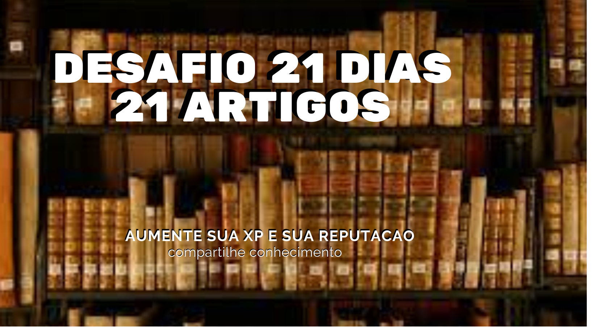
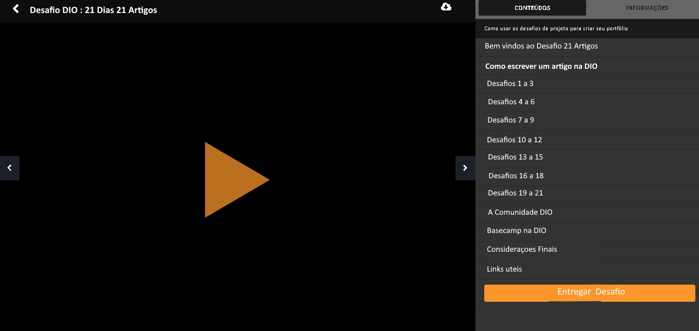
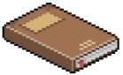
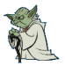
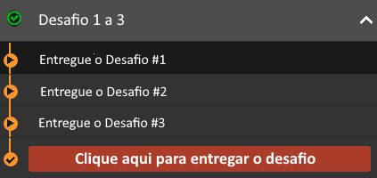
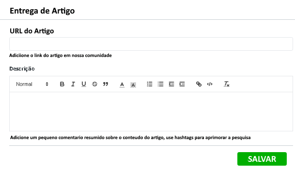
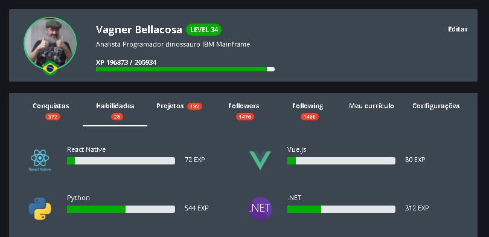

<!-- PROJECT SHIELDS -->

[![Contributors][contributors-shield]][contributors-url]
[![Forks][forks-shield]][forks-url]
[![Stargazers][stars-shield]][stars-url]
[![Issues][issues-shield]][issues-url]
[![MIT License][license-shield]][license-url]
[![LinkedIn][linkedin-shield]][linkedin-url]

<!-- PROJECT LOGO -->

# Projeto DIO   

## ProjetoDIO_Desafio21dias21Artigos  

Objetivo : Acolhimento aos padawans

Em 23 de Fevereiro de 2021, iniciei minha jornada como aluno na Digital Innovation One

Para comemorar este evento que mudou a minha vida. Apresento a proposta de Projeto.

### DESAFIO WEB.DIO.ME 21 dias 21 artigos

Uma forma de atrair, acolher, integrar e aprimorar a experiência educacional em nossa plataforma, inúmeros estudos confirmam que ao escrevermos sobre um assunto especifico a taxa de retenção do conhecimento é aumentada em 35% e a longo prazo as sinapses neurais nao desfragmentam-se mantendo o conhecimento adquirido por mais tempo. Incentivando a escrita iremos aprimorar a experiência.

Nossa comunidade baseada numa plataforma Gameficada com milestones e objetivos, ao meu ponto de vista, tornara-se mais divertida com este DESAFIO, nos últimos meses plantei a sementinha, divulgando constantemente nas Redes Sociais e no Fórum da Comunidade o DESAFIO.

Extraoficialmente o DESAFIO 21 Artigos existe, porem falta o reconhecimento oficial e atribuição de prêmios reais. Primeiramente, a ideia original nao foi minha e infelizmente nao conheço o autor, mas estava eu, após a saída do boteco online, andando aleatoriamente na Clear Web, quando o Google me alertou sobre alguém abandonado. Era um projeto do passado, triste, sozinho e solitário, conversei com ele e quando notei estava me seguindo. Alimentei o danado e o meme cresceu.

Numa comunidade beirando  os 700.000 DEVs inscritos, meu publico é 30% dos antigos e 100% dos novos inscritos. Na primeira fase aspiro atingir 210.000 pessoas, que ao publicarem 21 Artigos, ao final de 6 meses, teremos aproximadamente 441.000 artigos publicados. Imaginemos o alcance,  a repercussão nos motores de busca, o grau de compartilhamento nas redes sociais. Teremos um engajamento lendário.  Afinal serão pessoas compartilhando textos, iremos incrementar o trafego em Língua Portuguesa e criar uma mini-Wikipédia.

Claro que existe reveses, iremos criar demanda de servidores e aumentar o  gasto per-capita em alojamento, poderao surgir problemas legais em LGPD e Direitos autorais. Mas solucionaveis, criando um plus e incentivo ao aluno a participar ativamente da Comunidade DIO.

#### Custos envolvidos

- Equipe Técnica
	 - 🤷🏻 Custos de analise, desenvolvimento e deploy
	 - 🤷🏻 Custos de aumento de trafego
	 - 🤷🏻 Custos de aumento no alojamento
	 - 🤷🏻 Custos de LOGs e chamadas ao HelpDesk

#### Premiação

Ira inflacionar o ecossistema, porem como é aberto a todos e sem data de expiraçao, no final ninguem sera prejudicado.

A cada artigo 100 XP e 10 Reputação ( 2100 XP e 210 Reputação)

Badge 21 

​	Artigos Start e Diploma Inicio do Desafio 40 XP

Badge 21 

​	Artigos Champion e diploma Conclusão do Desafio 

Padawan Badge 

​	42 artigos publicados 40 XP 10 Reputação

Jedi Badge 

​	84 artigos publicados 40 XP 10 Reputação

Mestre Jedi Badge 

​	168 artigos publicados 40 XP 10 Reputação

Ancião Jedi Badge 

​	336 artigos publicados 40 XP 10 Reputação

### Workflow

Tela inicial

Exemplo de Navegação, acessando o Desafio 1 a 3

Exemplo de Navegação Entregue o Desafio #1

#### Controle e algoritmo

Será criado uma pagina web semelhante a estrutura dos LABS, onde teremos alguns vídeos informativos. ( Gostaria de apresentar um deles  :)  )

Serão 21 linhas de input para inclusao da url do artigo, sistema CRUD

Após inserir a url e salvar as alterações, será startado um processo batch para validação.

- Validações básicas
	- Devera validar url valida
	- Devera validar se o artigo  em questao pertence ao aluno
	- Devera validar minimo de 400 palavras
	- Devera validar existencia de palavras da Black List
	- Devera validar a existencia de hastags
	- Outras valiçoes que julgarem necessaria

Após processo OK, efetivar pontos no Score

- Em caso de Delete do Artigo, remover pontos do Score
- Em caso de Update revalidar artigo

As tarefas serão encadeadas, liberando uma a uma, após conclusão com sucesso da anterior, em caso de Delete a próxima é bloqueada.

## Novas Habilidades

Os DEVs na conclusão do Desafio ganharam novas habilidades em Soft Skill.

As habilidades elencadas devem receber pontuação.

- Analise
- Raciocínio Logico
- Empenho
- Empatia
- Escrita

---

#### * DIO - Digital Inovation One *
######  [Inscreva-se na Dio](https://digitalinnovation.one/sign-up?ref=R5J3ZLTIFS)  

######  [Vagner Bellacosa perfil na Dio](https://web.dio.me/users/vagnerbellacosa?tab=achievements)  

<!-- MARKDOWN LINKS & IMAGES -->
<!-- https://www.markdownguide.org/basic-syntax/#reference-style-links -->
[contributors-shield]: https://img.shields.io/github/contributors/VagnerBellacosa/DIO_Bootcamps.svg?style=for-the-badge
[contributors-url]: https://github.com/VagnerBellacosa/DIO_Bootcamps/graphs/contributors
[forks-shield]: https://img.shields.io/github/forks/VagnerBellacosa/DIO_Bootcamps.svg?style=for-the-badge
[forks-url]: https://github.com/VagnerBellacosa/DIO_Bootcamps/network/members
[stars-shield]: https://img.shields.io/github/stars/VagnerBellacosa/DIO_Bootcamps.svg?style=for-the-badge
[stars-url]: https://github.com/VagnerBellacosa/DIO_Bootcamps/stargazers
[issues-shield]: https://img.shields.io/github/issues/VagnerBellacosa/DIO_Bootcamps.svg?style=for-the-badge
[issues-url]: https://github.com/VagnerBellacosa/DIO_Bootcamps/issues
[license-shield]: https://img.shields.io/github/license/VagnerBellacosa/DIO_Bootcamps.svg?style=for-the-badge
[license-url]: https://github.com/VagnerBellacosa/DIO_Bootcamps/blob/master/LICENSE.txt
[linkedin-shield]: https://img.shields.io/badge/-LinkedIn-black.svg?style=for-the-badge&logo=linkedin&colorB=555
[linkedin-url]: https://www.linkedin.com/in/VagnerBellacosa/
[product-screenshot]: Image/Desafio21Dias21Artigos.png 

